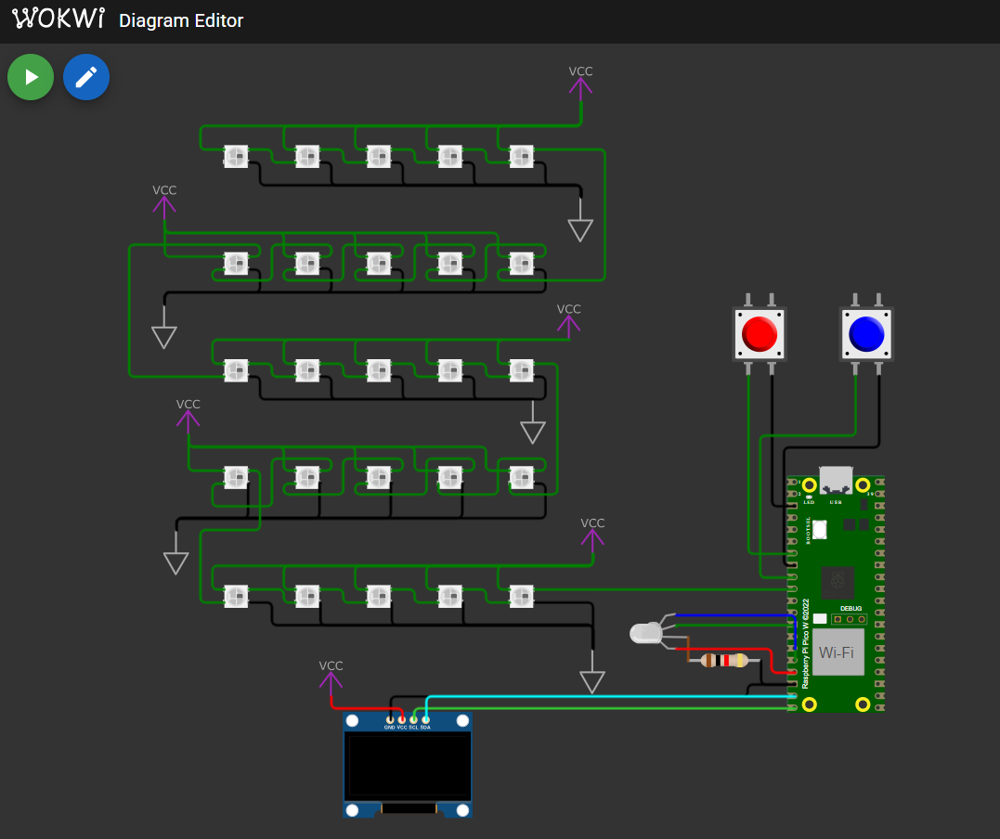
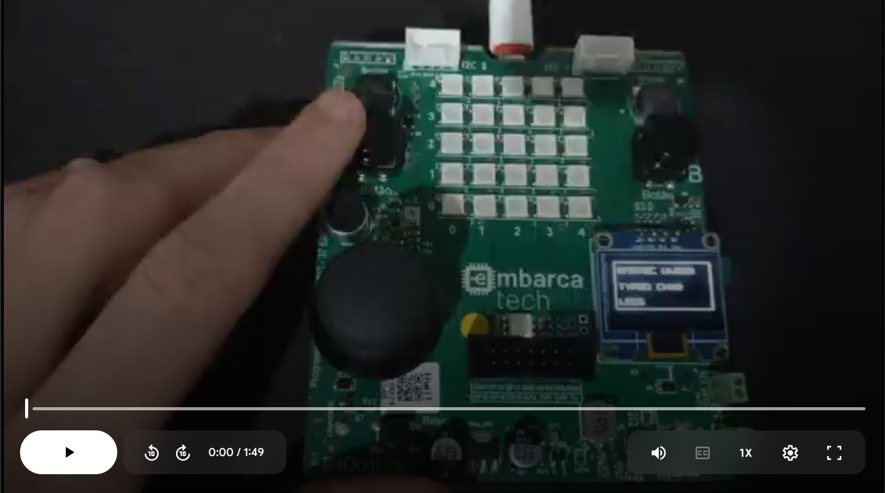

# Comunicação Serial com RP2040

Trabalho do dia 03/02/2025 do projeto EmbarcaTech


# Componentes BigDogLab

• Matriz 5x5 de LEDs (endereçáveis) WS2812, conectada à GPIO 7.

• LED RGB, com os pinos conectados às GPIOs (11, 12 e 13).

• Botão A conectado à GPIO 5.

• Botão B conectado à GPIO 6.

• Display SSD1306 conectado via I2C (GPIO 14 e GPIO15).


# Funcionalidades

1) Utilizando monitor serial inputs podém ser enviados que serão mostrados no Display,
    Caso estes inputs sejam Números seram exibidos na rede de leds 5x5.
2) Quando botão A for pressionado: 
    Lerde verde acionado para ligar/desligar
    Mensagem de ativação A no monitor serial.
    Display mostrará que o LED Green "G" está ligado.
3) Quando botão B for pressionado: 
    Lerde azul acionado para ligar/desligar
    Mensagem de ativação A no monitor serial.
    Display mostrará que o LED Blue "B" está ligado.


# Diagrama de pastas

```
SRC  
├── Unidade4_ComSerial_D03.c (arquivo principal a ser rodado) 
└── I2C
    ├── display.c (responsável pelo controle do envio do Display)
    ├── display.h
    ├── font.h (arquivo de armazenamento da tradução 8-Hex das letras e numeros usados)
    ├── ssd1306.c (Inicia e Prove funções de manipulação do Display)
    └── ssd1306.h 
└── matriz
    ├── matrizLed.c (responsável pelo controle da matriz de led 5x5)  
    ├── matrizLed.h  
    └── ledStruct.h (salva o struct utilizado para o RGB) 
``` 


# Modelo wokwi

Módelo wokwi utilizado para teste do sistema, pode ser utilizado no simulador Wokwi disponivel no vscode.
O módelo wokwi funciona melhor ativando o process_UART() em vez do process_USB() na main.




# Video de Funcionamento

[](https://drive.google.com/file/d/1dX4Jp0avNjiecwaIDkSKiIyV9NKIb3pN/view?usp=sharing)